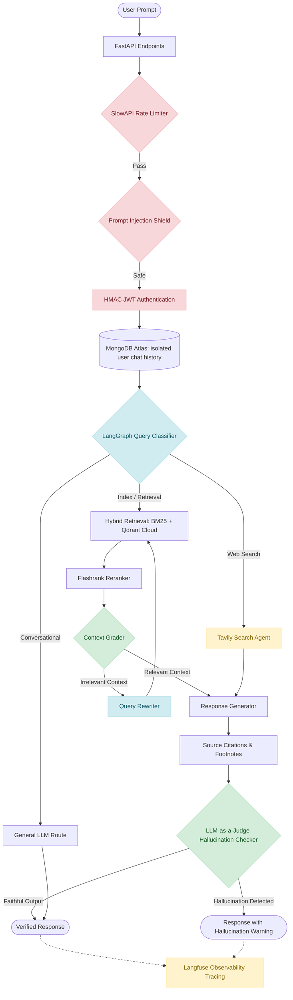

# 🌊 ContextFlow RAG Engine v2.0

[](https://www.python.org/)
[](https://fastapi.tiangolo.com/)
[](https://python.langchain.com/langgraph/)
[](https://qdrant.tech/)
[](https://www.docker.com/)

> **Production-grade, self-correcting RAG engine built with FastAPI & LangGraph. Features multi-provider LLM fallbacks (OpenRouter, Groq, Gemini), hybrid search (BM25 + Qdrant/FAISS), Flashrank reranking, Langfuse tracing, MongoDB session history, SlowAPI rate-limiting, and an automated LLM-as-a-Judge hallucination grader.**

<p align="center">
  
</p>

---

## 🏗️ Architecture Workflow



---

## 🚀 Key Features

*   **🔒 Security & Defense**:
    *   **HMAC Session Tokens**: Secure session generation and signing preventing token forgery.
    *   **User Isolation**: Chat histories are stored individually per user in MongoDB Atlas.
    *   **Input Sanitization**: Detects and blocks prompt injection and jailbreak attacks.
*   **🔍 High-Performance Retrieval**:
    *   **Hybrid Search**: Matches documents using both semantic vector embeddings and sparse keyword matching (`rank-bm25`).
    *   **Flashrank Reranking**: Locally evaluates and re-orders document chunks to ensure only top contexts are fed to the model.
*   **🤖 Hallucination Verification Agent**: Built-in LangGraph node verifying output compliance against retrieved sources, warning users if unfaithful statements are present.
*   **📝 Citation Formatting**: System instructions force inline sources and footnotes (e.g. `[Source: employee_handbook.pdf]`).
*   **🔌 Resilient Multi-Provider Fallback**: Chained model execution (OpenRouter $\rightarrow$ Groq $\rightarrow$ Gemini) to prevent query failures during rate-limiting or downtime.
*   **⚡ Singleton Caching & Memory Protection**: Employs a global Singleton caching pattern for retriever and database client instances. This prevents memory leaks and query degradation by avoiding repeated class allocations on every request, automatically invalidating cache handles only when new files are ingested.
*   **🐳 Dockerized**: Fully containerized environment with database and model-engine orchestrations.
*   **🛡️ SlowAPI Rate Limiter**: Rate limits core API routes to prevent server overloading and API key abuse.

---

## ⚙️ Environment Configuration (`.env`)

Configure your keys in the `.env` file (copied from `.env.example`):
```env
# LLM Endpoint Config
OPENAI_API_KEY=your_key_here
OPENAI_API_BASE=https://openrouter.ai/api/v1
OPENAI_MODEL_NAME=qwen/qwen-2.5-72b-instruct

# Tavily Search API Config
TAVILY_API_KEY=your_tavily_key_here

# MongoDB Connection (Cloud Atlas or Local Docker)
MONGO_URI=mongodb+srv://<user>:<password>@cluster.mongodb.net/
MONGO_DB_NAME=adaptive_rag

# Langfuse Observability Tracing settings
LANGFUSE_PUBLIC_KEY=your_langfuse_public_key
LANGFUSE_SECRET_KEY=your_langfuse_secret_key
LANGFUSE_BASE_URL=https://cloud.langfuse.com
```

---

## 🛠️ Installation & Setup

### Option 1: Virtual Environment (`venv`) Setup (Step-by-Step)

Follow these commands sequentially to clone and run the application locally on your machine:

1. **Clone the Repository**
   ```bash
   git clone https://github.com/rahulbamnuya/contextflow-rag-engine.git
   ```

2. **Navigate into the Project Folder**
   ```bash
   cd contextflow-rag-engine
   ```

3. **Configure Environment Variables**
   Copy the example file to create your local environment file:
   * **Windows (PowerShell)**:
     ```powershell
     Copy-Item .env.example .env
     ```
   * **Windows (CMD)** or **Linux/macOS**:
     ```bash
     cp .env.example .env
     ```
   *(Now open the `.env` file and insert your API keys for OpenRouter, Tavily, MongoDB, and Langfuse).*

4. **Initialize Virtual Environment**
   * Create the environment:
     ```bash
     python -m venv .venv
     ```
   * Activate the environment:
     * **Windows (PowerShell)**:
       ```powershell
       .venv\Scripts\Activate.ps1
       ```
     * **Windows (CMD)**:
       ```cmd
       .venv\Scripts\activate.bat
       ```
     * **Linux/macOS**:
       ```bash
       source .venv/bin/activate
       ```

5. **Install Required Packages**
   Ensure your pip is updated and install the dependencies:
   ```bash
   python -m pip install --upgrade pip
   pip install -r requirements.txt
   ```

6. **Run backend and frontend servers**
   * **Start Backend API (FastAPI)**:
     ```bash
     uvicorn src.main:app --host 0.0.0.0 --port 8000 --reload
     ```
   * **Start Frontend UI (Streamlit)**:
     Open a new terminal session, activate the venv, and run:
     ```bash
     streamlit run streamlit_app/home.py
     ```

---

### Option 2: Automation Setup Tool (Windows Batch)
Simply run the setup batch script in your terminal and select your action:
```bash
setup_dev.bat
```
*   Select `[1]` to install dependencies and configure the virtual environment.
*   Select `[2]` to run the PyTest suite.
*   Select `[3]` and `[4]` to launch the FastAPI backend and Streamlit frontend.

---

### Option 3: Running via Docker Compose
Build and run the entire stack (FastAPI, Streamlit, MongoDB, Qdrant) in one command:
```bash
docker compose up --build
```
*   **FastAPI Docs**: [http://localhost:8000/docs](http://localhost:8000/docs)
*   **Streamlit Web Interface**: [http://localhost:8501](http://localhost:8501)
*   **Qdrant Dashboard**: [http://localhost:6333/dashboard](http://localhost:6333/dashboard)
